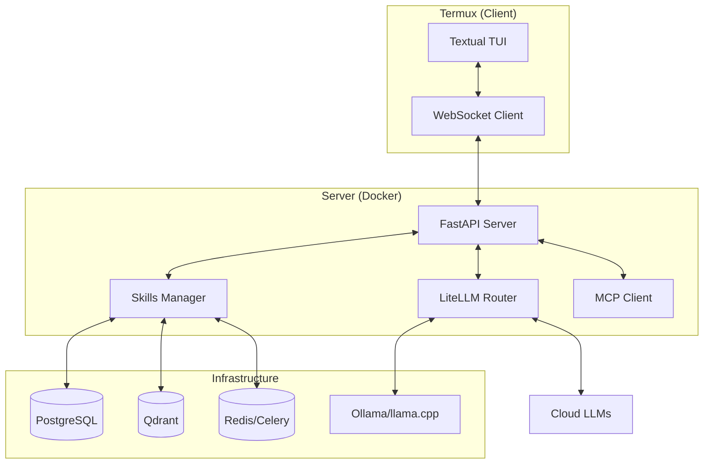

J# 🐉 GOKU: The Production-Ready AI Terminal Agent

GOKU is a premium, split-architecture AI assistant designed for Termux and high-performance terminal environments. It combines a streaming Textual TUI with a powerful Dockerized backend.

## 🚀 Key Features

- **Split Architecture**: Termux client (UI) connected to a scalable FastAPI backend.
- **Premium TUI**: Full-screen interactive dashboard with chat, tool logs, and status bar.
- **Hybrid Intelligence**: Fluid switching between Online APIs (LiteLLM) and Offline Models (Ollama/llama.cpp).
- **Skills Plugin System**: Extensible architecture for Shell, Git, Filesystem, and Web Automation.
- **MCP Native**: Deep integration with Model Context Protocol for secure tool execution.
- **RAG Memory**: Vector-based memory using Qdrant for project-wide context.

## 🏗️ Architecture



## 🛠️ Setup & Installation

### 1. Server Deployment (VPS or Desktop)
```bash
git clone https://github.com/elvisthebuilder/goku-terminal-agent.git
cd goku-terminal-agent
cp .env.example .env # Set your API keys
docker-compose up -d
```

### 2. Client Installation (Termux)
```bash
curl -sSL https://raw.githubusercontent.com/elvisthebuilder/goku-terminal-agent/main/install.sh | bash
```

## 🌍 How to Use (Open Source)

If you've discovered this project on GitHub and want to use it or contribute, follow these steps:

### 1. Prerequisites
- **Docker & Docker Compose**: Required for the backend (LLM router, memory, database).
- **Python 3.10+**: Required for the TUI client.
- **Termux (Optional)**: If you want to use it as a mobile agent.

### 2. Quick Start (Local Development)
```bash
# Clone the repository
git clone https://github.com/elvisthebuilder/goku.git
cd goku-terminal-agent

# Start the full backend stack
docker-compose up -d

# Install client dependencies
pip install -r requirements.txt

# Launch the GOKU TUI
python3 client/app.py
```

## 🤝 Contributing

We welcome contributions!
1. **Fork** the repository.
2. **Create a branch** for your feature (`git checkout -b feature/amazing-skill`).
3. **Commit** your changes (`git commit -m 'Add some amazing skill'`).
4. **Push** to the branch (`git push origin feature/amazing-skill`).
5. **Open a Pull Request**.

## 🛡️ Security & Safety
Goku is designed with a **Safety First** approach:
- **Approval Required**: No shell command or web form is submitted without explicit user confirmation (`Y/N` or `Submit`).
- **Sandboxed Execution**: Most tools run in limited environments.
- **Thought Transparency**: See exactly why the agent is taking an action.
